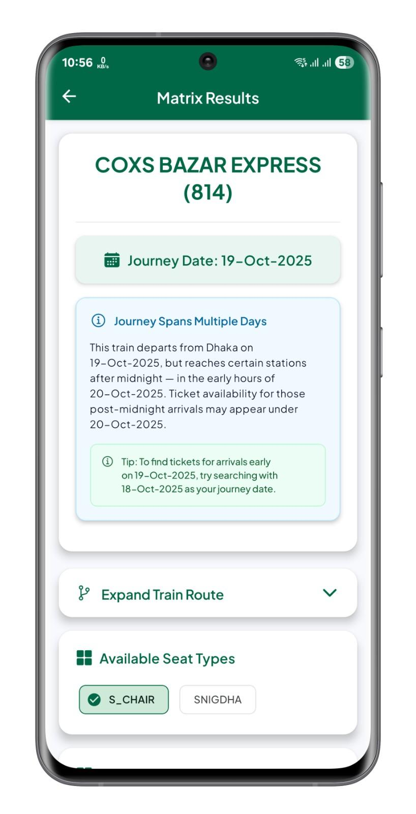
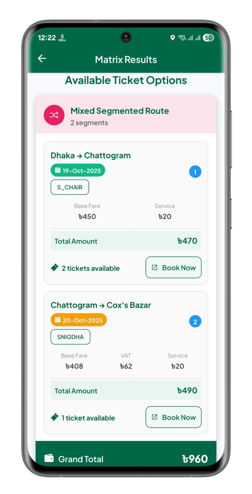
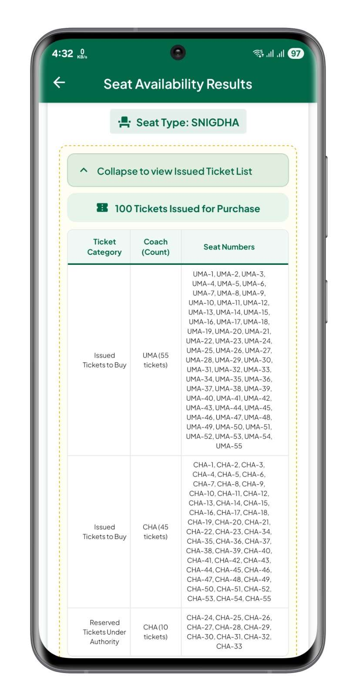

<h1 align ="center">Train Seat</h1>
  

| 🚨 PROJECT DISCONTINUATION NOTICE 🚨 |
|-------------------------------------|
| Starting **October 14, 2025**, this project is **discontinued** and **no longer maintained**. All resources are archived now.  Thank you for your support over the long journey. Visit [trainseat.onrender.com/sunset](https://trainseat.onrender.com/sunset) to learn more about why this project was discontinued. |

  

**Your Ultimate Companion for Bangladesh Railway Ticket Finder**

---

## About

Train Seat is a comprehensive mobile application designed to help passengers check real-time train seat availability and access detailed seat matrix information for Bangladesh Railway. Whether you're planning a journey or checking last-minute availability, this app provides up-to-date information to make your travel planning easier and more convenient.

---

## Requirements

- Android 7.0+
- ARM 32-bit (armeabi-v7a) or ARM 64-bit (arm64-v8a)
- 50 MB storage
- Internet connection
- Account credentials (Auth Token and Device Key) to fetch data

---

## What's New

**CHANGELOG [Oct 13, 2025]**
- Added notice dialog for app updates
- Handled 429 error for too many requests

[ **For detailed changelog and previous versions, visit:** [github.com/nishatrhythm/Train-Seat-App-Releases/releases](https://github.com/nishatrhythm/Train-Seat-App-Releases/releases) ]

---

## App Information

- **Version:** 2.4.2
- **Current Version Release Date:** October 13, 2025
- **First Published:** September 29, 2025

---

## Feedback

- **Google Form:** [forms.gle/NV72PC1z75sq77tg7](https://forms.gle/NV72PC1z75sq77tg7)

---

## Website

- **Train Seat Matrix:** [seat.onrender.com](https://seat.onrender.com)
- **Train Seat Availability:** [trainseat.onrender.com](https://trainseat.onrender.com)
- **Train Seat Report:** [trainreport.onrender.com](https://trainreport.onrender.com)

---

## Open Source & Data Practices

This Android project is open source to ensure transparency in our data practices. We believe in user privacy and ethical data handling, so you can review how the app works and manages your information. No sensitive or personal data is collected or misused. Explore the code and see our commitment to responsible data use.

---

## App Screenshots

<table>
<tr>
<td> Search trains between two stations</td>
<td> View available trains for the route</td>
<td> View seat matrix for a train</td>
</tr>
<tr>
<td> Generated seat matrix for selected train</td>
<td> Seat matrix for all seat types</td>
<td> View route details and stops</td>
</tr>
<tr>
<td> Check seat availability for a train</td>
<td> Check direct, segmented, or mixed tickets</td>
<td> Search routes to check availability</td>
</tr>
<tr>
<td> View detailed seat availability per route</td>
<td> See available and reserved ticket counts</td>
<td> Enter credentials to fetch live data</td>
</tr>
<tr>
<td> View terms and privacy policy details</td>
<td></td>
<td></td>
</tr>
</table>

---

## Important: Why Railway Credentials are Needed in Train Seat App

>To search for train tickets on the official e-ticket website or Rail Sheba app, you need to be logged in with your railway account. This is because the railway system checks if you're a registered user before showing any information. Without proper login details, the app can't access the official data.
>
>Recently, Bangladesh Railway added extra security with Cloudflare verification for logins. Because of this change, we can't automatically get your Auth Token and Device Key from just your phone number and password. You'll need to get these codes yourself from the official website, then enter them here manually.
