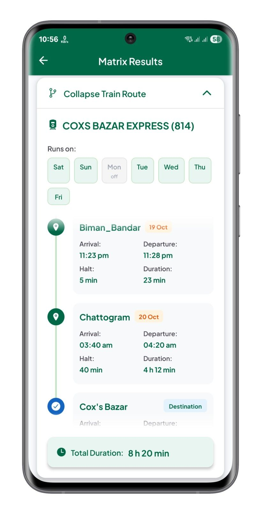

<h1 align ="center">Train Seat</h1>

**Your Ultimate Companion for Bangladesh Railway Ticket Finder**

---

## About

Train Seat is a comprehensive mobile application designed to help passengers check real-time train seat availability and access detailed seat matrix information for Bangladesh Railway. Whether you're planning a journey or checking last-minute availability, this app provides up-to-date information to make your travel planning easier and more convenient.

---

## Requirements

- Android 7.0+
- ARM 32-bit (armeabi-v7a) or ARM 64-bit (arm64-v8a)
- 50 MB storage
- Internet connection
- Account credentials (Auth Token and Device Key) to fetch data

---

## What's New

**CHANGELOG [Oct 10, 2025]**
- **Fixed:** All services were broken after the e-Ticket platform introduced a verification method on the login page.
- **Update:** Data fetching now requires an auth token and device key.

[ **For detailed changelog and previous versions, visit:** [github.com/nishatrhythm/Train-Seat-App-Releases/releases](https://github.com/nishatrhythm/Train-Seat-App-Releases/releases) ]

---

## App Information

- **Version:** 2.3.0
- **Current Version Release Date:** October 10, 2025
- **First Published:** September 29, 2025

---

## Feedback

- **Google Form:** [forms.gle/NV72PC1z75sq77tg7](https://forms.gle/NV72PC1z75sq77tg7)

---

## Website

- **Train Seat Matrix:** [seat.onrender.com](https://seat.onrender.com)
- **Train Seat Availability:** [trainseat.onrender.com](https://trainseat.onrender.com)
- **Train Seat Report:** [trainreport.onrender.com](https://trainreport.onrender.com)

---

## Open Source & Data Practices

This Android project is open source to ensure transparency in our data practices. We believe in user privacy and ethical data handling, so you can review how the app works and manages your information. No sensitive or personal data is collected or misused. Explore the code and see our commitment to responsible data use.

---

## App Screenshots

<table>
<tr>
<td> Search any train between stations</td>
<td> See available trains between stations</td>
<td> Search specific train for seat matrix</td>
</tr>
<tr>
<td> Generated seat matrix for specific train</td>
<td> Generated seat matrix for all seat types</td>
<td> See route details for specific train</td>
</tr>
<tr>
<td> Check ticket availability for the specific train</td>
<td> Check direct, segmented or mixed segmented tickets</td>
<td> Search routes for seat availability</td>
</tr>
<tr>
<td> Check in details seat availability for routes</td>
<td> See how many tickets are available or in booking</td>
<td> Setup your credentials to fetch the data</td>
</tr>
<tr>
<td> See terms and conditions and privacy policy to understand data usage</td>
<td></td>
<td></td>
</tr>
</table>

---

## Important: Why Railway Credentials are Needed in Train Seat App

> When you search on the e-ticket website or the Rail Sheba app, you must be signed in with your railway credentials. Technically, this is required because the railway server checks whether you are an authorised user before allowing access to the data. Without valid credentials, no information can be fetched from the official server.